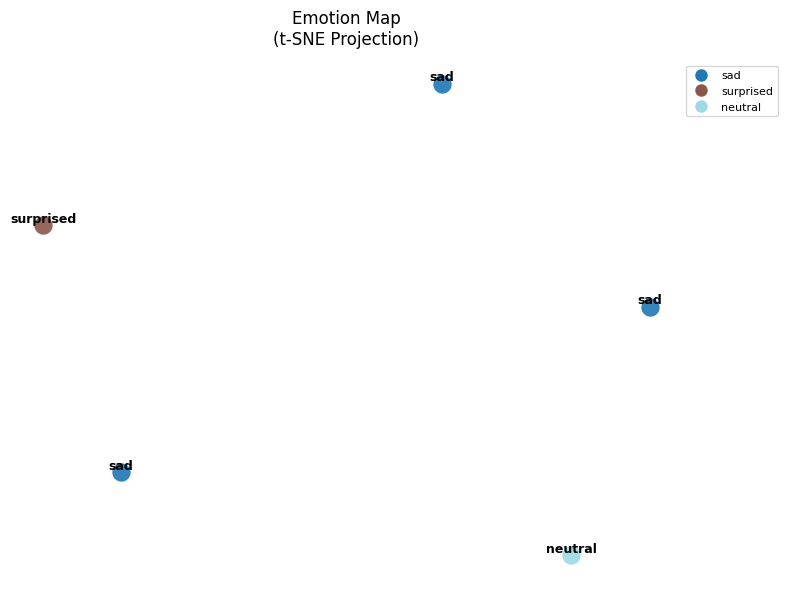

# VoiceEmoji

Проект для анализа эмоционального состояния по аудиозаписи и генерации психоэмоциональных карт.  
**Поддерживаемые форматы**: MP3, OGG, WAV.

 
[](https://huggingface.co/)

## Особенности
- Анализ аудио с использованием модели **Whisper-large-v3** для распознавания эмоций.
- Визуализация результатов:
  - **Эмоциональная карта** (t-SNE) — показывает распределение эмоций в пространстве.
  - **Психическая карта** (PCA) — отображает психологические характеристики.
- Интуитивный графический интерфейс (GUI) на базе Tkinter.

## Как это работает
1. Аудио разбивается на сегменты по 10 секунд.
2. Для каждого сегмента определяется эмоция с помощью предобученной модели.
3. На основе полученных эмоций строятся:
   - 2D-визуализация с использованием t-SNE для группировки схожих состояний.
   - PCA-анализ для интерпретации психологических паттернов.

## Скриншоты
| Эмоциональная карта | Психическая карта |
|----------------------|--------------------|
|  |  |

## Требования
- Python 3.8.10
- Зависимости:  
  ```bash
  pip install -r requirements.txt
```
