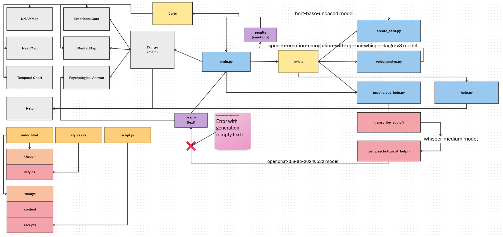

# VoiceEmoji

A project for analyzing the emotional state based on audio recordings and generating psycho-emotional maps.  
**Supported formats**: MP3, OGG, WAV.

  

## Features
- Audio analysis using the **Whisper-large-v3** model for emotion recognition.
- Visualization of results:
  - **Emotional map (t-SNE)** — shows the distribution of emotions in space.
  - **Mental Map (PCA)** — displays psychological characteristics.
  - **Time chart** — dynamics of emotions by audio segments.
  - **UMAP projection** — is an alternative visualization while maintaining the global structure.
  - **Heat map** — intensity of emotions by category.
- Intuitive graphical interface (GUI) based on Tkinter.

## How it works <br/> 
1. Audio is divided into segments of 10 seconds each.
2. For each segment, an emotion is determined using a pre-trained model.
3. Based on the received emotions, we build:
- **2D visualization** using t-SNE and UMAP to group similar states.
- **PCA analysis** for interpreting psychological patterns.
- **Timeline** with color-coded emotions.
- **Heat map** to assess the frequency of emotions.

## Screenshots
| Emotional map | Mental Map | UMAP Map |
|----------------------|--------------------|----------------------|
|  |  |  |
| Temporal Chart | Heat Map |
|  |  |


## Models used
[speech-emotion-recognition-with-openai-whisper-large-v3](https://huggingface.co/firdhokk/speech-emotion-recognition-with-openai-whisper-large-v3) — classification of emotions.<br/>
[bert-base-uncased](https://huggingface.co/google-bert/bert-base-uncased) — vector representation of the text.<br/>
[whisper-medium](https://huggingface.co/openai/whisper-medium) — transcribing audio.<br/>
[]() — advice generation.

## Possible errors
- Error when processing audio: Make sure that the file is not corrupted and corresponds to the supported formats.
- Dependency issues on Windows: Install Microsoft Visual C++ Build Tools.

## Requirements
- Python 3.8.10
- Dependencies:  
```bash
  pip install -r requirements.txt
```

## Usage
```bash
git clone https://github.com/leksik-phew/VoiceEmoji.git
cd VoiceEmoji
pip install -r requirements.txt
python main.py
```

## Feedback: tg @bez_organov
